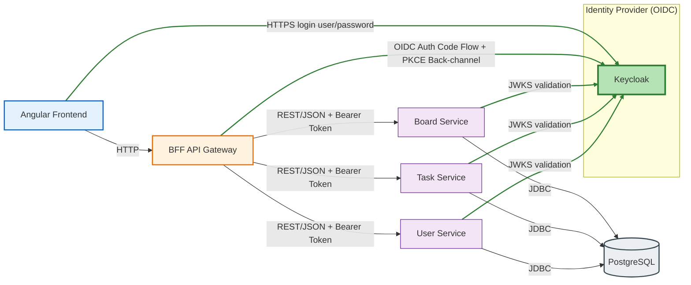

# Kanban App (Angular + Spring Boot 4, Java 25, Keycloak, PostgreSQL)

## Aperçu
- Frontend Angular 17 (standalone components) : liste des boards, détail avec colonnes To do / Doing / Done, création via popup, édition inline, déplacement et suppression des tickets.
- Backend multi-modules Maven (Spring Boot 4.0.0, Java 25) : `bff-service` (OIDC + façade API), `board-service`, `task-service`, `user-service` (JPA, Flyway, Actuator, Resource Server).
- Authentification Keycloak (realm `kanban-realm`), PostgreSQL unique (schémas par service), monitoring Prometheus/Grafana.
- Conteneurisation complète via Docker Compose + Makefile.

## Démarrage rapide (stack complète)
```bash
cp env.template .env        # variables OIDC + logs
echo "127.0.0.1 localhost-keycloak" | sudo tee -a /etc/hosts
make all                    # build + docker compose up
```
Points d’entrée :
- Frontend (nginx) : http://localhost:8080
- Keycloak : https://localhost-keycloak:8085 (admin/admin, cert auto-signé)
- Grafana : http://localhost:3000 (admin/admin)
- Prometheus : http://localhost:9090
- PostgreSQL : localhost:5432 (user/pass/db : kanban)
Le front appelle uniquement le BFF via `http://localhost:8080/api`; les microservices ne sont pas exposés directement.

## Dev local sans Docker
Prérequis : Java 25 + Maven 3.9+, Node 20+/npm 10+.
```bash
# BFF
mvn -pl bff-service spring-boot:run
# Services métiers
mvn -pl board-service spring-boot:run
mvn -pl task-service spring-boot:run
mvn -pl user-service spring-boot:run
# Frontend
cd frontend && npm install && npm start
```
Configurer les variables d’environnement comme dans `.env` (issuer Keycloak, secrets BFF, URLs des services).

## Endpoints principaux
| Composant | Base URL | Notes |
| --- | --- | --- |
| Frontend | `http://localhost:8080` | SPA servie par nginx |
| BFF (proxy) | `http://localhost:8080/api` | `/boards/**`, `/tasks/**`, `/users/**` |
| Keycloak | `https://localhost-keycloak:8085` | Realm `kanban-realm`, cert auto-signé |
| Grafana | `http://localhost:3000` | Dashboard “Kanban Platform - Overview” |
| Prometheus | `http://localhost:9090` | Scrape `/actuator/prometheus` des services |

## Diagramme (Mermaid)


## OIDC (BFF)
- Flow Authorization Code, PKCE pour le client public (`kanban-frontend`), client confidentiel (`kanban-bff`) pour l’échange de token.
- Callback OAuth : `http://localhost:8080/login/oauth2/code/keycloak`.
- Cookies : Keycloak sur `localhost-keycloak`, BFF sur `localhost` (`BFFSESSIONID`). Accepter le cert auto-signé lors du premier login.
- Un conteneur `keycloak-certgen` génère le keystore partagé; les backends importent ce cert au démarrage.
- Pourquoi PKCE ? Le frontend est un client public (Angular dans le navigateur, pas de secret stockable). PKCE empêche l’échange du code par un attaquant qui intercepterait la redirection. Le BFF est, lui, un client confidentiel (secret en backend) qui échange le code contre les tokens.

## Bases de données
- PostgreSQL unique avec schémas `board_schema`, `task_schema`, `user_schema`.
- Flyway par microservice pour la création des tables (pas de data de démo fournie).

## Tests
- Unitaires : JUnit 5, AssertJ, Mockito.
- Intégration : Spring Boot Test + Testcontainers PostgreSQL.
